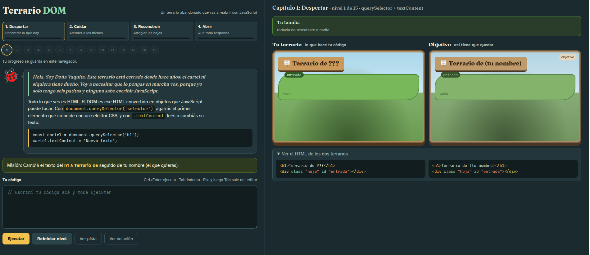

# Terrario DOM 🐞

Un juego para aprender a manipular el DOM con JavaScript. Un terrario cerrado desde hace años, una mariquita llamada Doña Vaquita que necesita ayuda, y 15 niveles en los que vas rescatando bichos a fuerza de `querySelector`, `classList`, `createElement` y `addEventListener`.

Es un solo archivo, `index.html`. Sin frameworks, sin build, sin instalar nada.



## Cómo jugar

1. Leé lo que te cuenta Doña Vaquita y la misión del nivel.
2. A la derecha ves dos terrarios: **el tuyo** (lo que hace tu código) y **el objetivo** (así tiene que quedar). Abajo podés ver el HTML de los dos.
3. Escribí JavaScript en el editor y tocá **Ejecutar** (o `Ctrl+Enter`). Tu código recibe un `document` que apunta a tu terrario.
4. Si el terrario queda igual al objetivo, ganás el nivel. Los bichos que rescatás se suman a tu familia.
5. Si te trabás, **Ver pista** te orienta y **Ver solución** te pega el código.

Los niveles se agrupan en 4 capítulos: Despertar, Cuidar, Reconstruir y Abrir. Cada capítulo completo te da una medalla.

El progreso se guarda solo en tu navegador (`localStorage`). Si querés que se guarde en la nube, mirá más abajo.

## Correrlo local

Alcanza con abrir `index.html` en el navegador. Si preferís un servidor:

```sh
npx serve .
# o
python3 -m http.server 8080
```

## Tests

```sh
npm install
npm test
```

Los tests cargan `index.html` con jsdom y resuelven cada nivel con su propia `solution`. Si agregás un nivel, el test lo cubre automáticamente.

## Deploy

Cada push a `main` corre `npm test` y, si pasa, publica la raíz del repo en GitHub Pages con la Action de `.github/workflows/pages.yml`. La URL queda en `https://<usuario>.github.io/<repo>/`.

Configuración manual, una sola vez, en el repo de GitHub: **Settings > Pages > Build and deployment > Source: GitHub Actions**. Sin eso, la Action falla en el paso de deploy.

Si el nombre del repo o el usuario no son `PedroBraude/js-dom-terrario`, actualizá las URLs de `og:url`, `og:image` y `twitter:image` en `index.html`.

## Activar la nube (Supabase)

Por defecto la nube está apagada: `CLOUD` en `index.html` tiene la URL y la key vacías. Para activarla:

1. Creá un proyecto gratis en [supabase.com](https://supabase.com).
2. En **Authentication > Providers**, activá **Email** con magic link (sin contraseña).
3. En el **SQL Editor**, ejecutá:

```sql
create table progreso (user_id uuid primary key references auth.users, data jsonb, updated_at timestamptz default now());
alter table progreso enable row level security;
create policy "propio" on progreso for all using (auth.uid() = user_id) with check (auth.uid() = user_id);
```

4. En **Settings > API**, copiá la **Project URL** y la **anon key** y pegalas en `index.html`:

```js
const CLOUD = { url: 'https://xxxx.supabase.co', key: 'eyJ...' };
```

5. En **Authentication > URL Configuration**, agregá la URL donde va a vivir el juego a las **Redirect URLs**, si no el magic link no vuelve.

Con eso el juego muestra un campo de email. El jugador recibe un link, entra, y su progreso se sincroniza entre dispositivos. La anon key es pública por diseño: la seguridad la da la política RLS de arriba, que solo deja a cada usuario leer y escribir su propia fila.

## Agregar un nivel nuevo

Los niveles viven en el array `LEVELS` dentro de `index.html`. Cada uno es un objeto así:

```js
{
  ch: 1,                              // índice del capítulo en CHAPTERS (0 a 3)
  title: "classList.add",             // nombre corto, se ve en el título y en el tooltip del nivel
  story: `Texto de Doña Vaquita...`,  // narrativa del nivel (acepta HTML)
  noche: true,                        // opcional: pinta los terrarios de noche
  html: `<div class="hoja" id="fondo">...</div>`,   // HTML inicial del terrario del jugador
  goal: `<div class="hoja" id="fondo">...</div>`,   // HTML de cómo tiene que quedar
  lesson: `<p>Explicación del concepto...</p><pre>ejemplo</pre>`,  // lo que enseña la guía
  task: `Agregale la clase <strong>brilla</strong> a Luz.`,        // la misión, en HTML
  hint: `Selector: '[data-animal="luciernaga"]'...`,               // pista en texto plano
  solution: `document.querySelector('...').classList.add('brilla');`, // código que resuelve el nivel

  check: s => s.querySelector('.bicho')?.classList.contains('brilla'),
  precheck: s => !s.querySelector('.bicho')?.classList.contains('feliz'),
  simulate: s => { s.querySelector('#alimentar')?.click(); return 'Toqué el botón 1 vez.'; },
  gana: { e: '✨', n: 'Luz' },
  onWin: s => { state.nombre = '...'; },
}
```

Qué hace cada campo especial:

- **`html` / `goal`**: strings de HTML. Podés usar `{{nombre}}` y se reemplaza por el nombre que el jugador puso en el nivel 1. El mundo entiende `<span class="bicho" data-animal="...">` como bicho, `<div class="hoja">` como hoja y `<span class="planta" data-nivel="...">` como planta. Los animales disponibles están en el CSS (`mariquita`, `caracol`, `oruga`, `mariposa`, `abeja`, `arana`, `hormiga`, `rana`, `luciernaga`).
- **`check(s)`**: recibe el elemento raíz del terrario del jugador **después** de ejecutar su código. Devuelve `true` si el nivel está resuelto. Es la única verdad del nivel: el juego no compara el HTML contra `goal`, así que el check tiene que ser específico (comprobá lo que tiene que cambiar y también lo que **no** tiene que cambiar).
- **`precheck(s)`**: opcional. Se evalúa **antes** de `simulate`. Si devuelve `false`, el nivel no se da por ganado aunque `check` pase, y la guía avisa que el cambio se hizo demasiado pronto. Sirve para niveles de eventos: el jugador no tiene que aplicar el cambio al ejecutar, sino al hacer clic.
- **`simulate(s)`**: opcional. Corre después del código del jugador y antes de `check`. Ideal para disparar clics con `.click()`. Devuelve un string que la guía muestra al jugador ("Regué 3 veces.").
- **`gana`**: opcional. Un objeto `{ e: 'emoji', n: 'Nombre' }` o un array de ellos. Se suman a la familia la primera vez que se gana el nivel.
- **`onWin(s)`**: opcional. Corre una vez al ganar, con el terrario final. El nivel 1 lo usa para guardar el nombre del jugador en `state.nombre`.

Para agregar el nivel, insertalo en `LEVELS` en la posición que corresponda y correr `npm test`: el test resuelve todos los niveles con su `solution`, así que si el check y la solución no coinciden, se rompe ahí.

## Seguridad: cómo corre el código del jugador

El código que escribís se ejecuta con `new Function` **en la misma página**, no en un iframe. Recibe un `document` falso limitado a tu terrario y un `window` falso, así que `document.querySelector`, `window.document` o `globalThis.document` apuntan siempre al terrario y no a la página.

Eso es una comodidad para aprender, no una barrera de seguridad. Riesgo residual, documentado a propósito:

- Cualquier elemento que te devuelve el `document` falso es un elemento real: por `elemento.ownerDocument`, `elemento.parentElement` o `getRootNode()` se llega a la página entera.
- `Function('return this')()` devuelve el `window` real. También son accesibles `localStorage`, `fetch`, `location` y las variables del juego (`state`, `LEVELS`).
- No hay Content Security Policy que lo impida, porque el juego necesita `new Function` para funcionar.

Por qué está bien así: el código es tuyo y corre solo en tu navegador, igual que si lo escribieras en la consola de DevTools. Nadie más lo ejecuta. Lo peor que puede pasar es que rompas la página para vos, y se arregla recargando. Con la nube activada, tu código se guarda en tu fila de Supabase y solo vos lo leés de vuelta (política RLS), así que tampoco viaja a otros usuarios.

Si algún día el juego mostrara o ejecutara código de otras personas (por ejemplo, soluciones compartidas por link), esto deja de alcanzar: habría que mover el terrario a un `<iframe sandbox>` de otro origen y comunicarse por `postMessage`.

## Accesibilidad

- Se puede jugar entero con teclado: `Ctrl+Enter` ejecuta, `Tab` indenta dentro del editor y `Esc` seguido de `Tab` saca el foco del editor.
- Los mensajes de Doña Vaquita, la pista y la consola son regiones `aria-live`, así que un lector de pantalla lee el feedback de cada intento.
- Los botones de nivel tienen `aria-label` y `aria-current`; el final es un `role="dialog"` que deja el resto de la página `inert`.
- Respeta `prefers-reduced-motion`.
- Salvedad conocida: los dos terrarios contienen `<h1>` propios porque son el HTML del ejercicio (el nivel 1 enseña `querySelector('h1')`). Navegando por encabezados van a aparecer debajo de los `h3` de cada terrario.

## Licencia

MIT. Ver [LICENSE](LICENSE).
